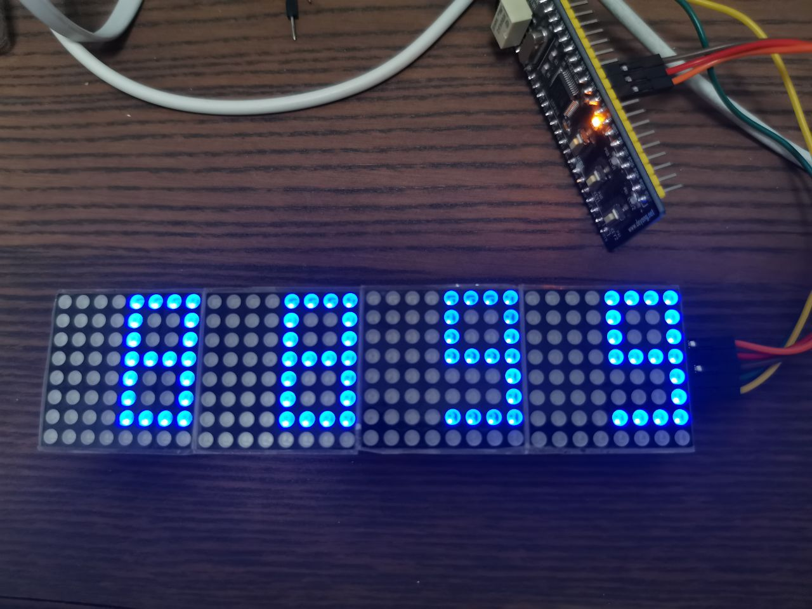

# stm32-hardware-drivers

1. 基于 stm32F103C8 开发
2. 基于 STM32 官方标准库开发 这个 STM32F10x Standard Peripherals Firmware Library
3. 全部 例程 通过实际测试，还挺好玩的 😁😁

# 分类

- 时钟类 DS1302 DS3231
- 温湿度 AM2302 LM75a
- 显示类 Max7219 数码管和点阵 I2C 驱动 OLDE 屏， e-paper 墨水屏

# 一些硬件

# 我想说的

其实编写一个器件的驱动并不难，只要了解 STM32 gpio 和 各种通信接口 编程方法，加上对 器件的数据手册的阅读就可以实现，而且以后几乎很少修改。但对于新手学习来说，还是挺重要的，一个好的代码 参考，可以减少新手学习硬件编程的挫败感！

# 关于我

我是一个 上手 STM32 没多久的新手，我程序员出身 ，希望这些代码 对你有帮助！

# 贡献

如果在使用中有什么问题，欢迎提 issue, 如果 你也有通过检测的硬件驱动，欢迎提交 pr
