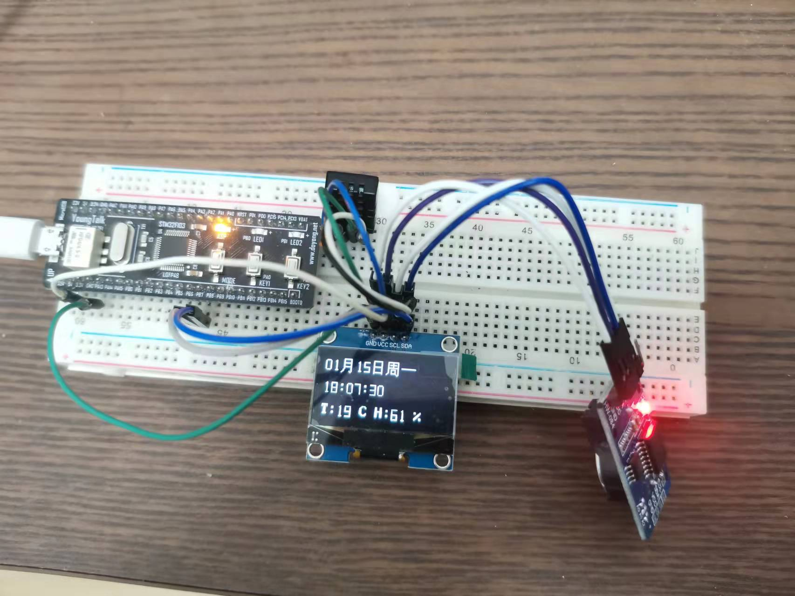

# stm32-hardware-drivers

这个仓库收集整理了一些常见的显示屏，传感器的驱动程序，仅大家参考学习！

1. 基于 stm32F103C8 开发
2. 基于 STM32 官方标准库(STM32F10x Standard Peripherals Firmware Library) 开发
3. 全部代码通过实际测试，请放心使用
4. PS : 还挺好玩的 😁😁

# 一些硬件
| 项目名 | 相关器件 | 图片
----------|-----------|-------------
8*8*4 点阵屏 | 8*8点阵, Max7219 级联|
OLED 时钟| OLED + DS3231 + DHT20 |

# 我想说的

其实编写一个器件的驱动并不难，只要了解 STM32 gpio 和 各种通信接口 编程方法，加上对 器件的数据手册的阅读就可以实现，而且以后几乎很少修改。但对于新手学习来说，还是挺重要的，一个好的代码 参考，可以减少新手学习硬件编程的挫败感！

# 关于我

上手 STM32 没多久的新手，web前端程序员出身 ，希望这些代码 对你有帮助！

# 贡献

如果在使用中有什么问题，欢迎提 issue, 如果 你也有通过检测的硬件驱动，欢迎提交 pr
